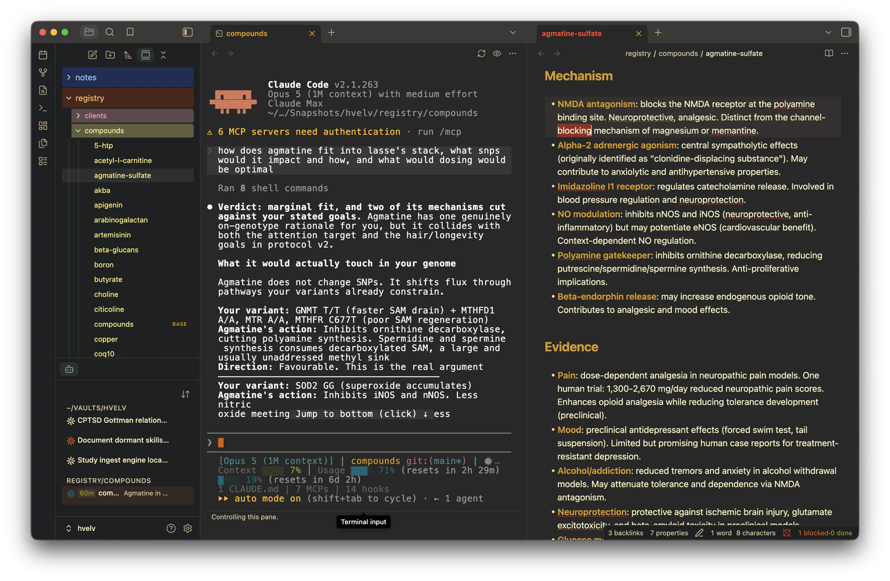

# Herdr for Obsidian

Your coding agents run persistently in [herdr](https://github.com/ogulcancelik/herdr),
a terminal workspace that keeps them alive across sessions. This plugin brings the
ones that belong to your vault into Obsidian:

- **Agent list** in the sidebar: every agent of the matching herdr workspace, with
  its status, name, what it is doing, and its prompt-cache countdown. Sort by
  urgency or name, group by folder or by herdr tab. It updates live.
- **Terminals** as Obsidian tabs: open any agent's live terminal, type in it, or
  watch it read-only. Open it beside the note you are working on, or reuse one tab.
- **Notifications** when an agent stops and wants you, or finishes, with a status
  bar count.
- **Start agents from folders**: a hover button and a context-menu entry on any
  folder in the file explorer start an agent there, in the right herdr tab.
- **Remote herdr** over SSH: the same list, actions and terminals against herdr on
  another machine, as long as that machine has a synced mirror of the vault.

Nothing here changes how herdr behaves for anyone using it outside Obsidian. All
the workspace filtering happens on the plugin side.

## Supported agent CLIs

The plugin starts and recognises every agent kind herdr 0.8 can start: **Claude
Code**, **Codex**, **Gemini CLI**, **OpenCode**, **Pi**, **Cursor**, **Amp**,
**GitHub Copilot CLI**, **Kimi**, **Droid** and **Grok**. Each has an icon in the
list; a kind the plugin does not know yet gets a neutral one. Anything herdr can
attach to also shows up, whatever started it.

## Requirements

- Obsidian **desktop** 1.7.2 or newer. No mobile build.
- macOS or Linux.
- **herdr 0.8.0 or newer, already running.** The plugin never starts, stops or
  updates a herdr server; it attaches to the one you have.
- For the remote profile: `ssh` on this machine, key-based login that does not
  prompt, and a copy of the vault on the remote host kept in sync by whatever you
  already use (Obsidian Sync, Self-hosted LiveSync, Syncthing, git).

## Install

Until the plugin is in the community list, install it with
[BRAT](https://github.com/TfTHacker/obsidian42-brat): add
`nytafar/obsidian-herdr` as a beta plugin, then enable **Herdr** under Community
plugins. Manual install works too: put `main.js`, `manifest.json` and
`styles.css` from a [release](https://github.com/nytafar/obsidian-herdr/releases)
into `<vault>/.obsidian/plugins/herdr/` and reload Obsidian.

## Five-minute setup

1. Open **Settings → Herdr**. The status block at the top says which herdr binary
   was found, which socket answers, the server version, and which workspace
   matched your vault. Every setup problem shows up there first.
2. **Binary not found?** Obsidian launched from the Dock has no login `PATH`. Put
   the output of `which herdr` into **Herdr binary**. **Extra PATH entries** does
   the same for the tools your agents need.
3. **No workspace matched?** The plugin picks the herdr workspace whose label
   equals the vault folder name, else the one with the most panes inside the vault
   path. Label a workspace like your vault, or pin **Workspace ID**.
4. Run **Herdr: Show herdr agents** from the command palette. The list opens in
   the left sidebar and stays wherever you drag it.

Only panes that run an agent are listed; plain shells stay invisible.

## Using it

**The list.** Each row is one agent: a kind icon coloured by status (orange
blocked, green done, blue working, faint idle), the agent's name, its current task
from the terminal title, a prompt-cache countdown while one is running, and its
folder. The header button sets sort (herdr's own priority order, or alphabetical)
and grouping (herdr tab, working directory, or none). Clicking a row opens the
agent's terminal; the button that appears on hover jumps to the pane in the herdr
TUI. A setting swaps the two.

**Terminals.** A terminal tab attaches to the agent's pane in one of two modes,
switchable with the eye button:

- **Control** (default): you type, you scroll, and the herdr pane follows the
  Obsidian tab's size while the tab is visible. herdr allows one controller per
  pane, so attaching takes over. A control tab left hidden for thirty seconds
  hands control back to herdr and takes it again when you return.
- **Observe**: read-only, never resizes, any number of watchers.

Shift+Enter inserts a line break in the agent's composer instead of submitting.
Scrolling moves the pane's own scrollback in herdr, so what you see is what the
TUI sees. Text selection works as usual; mouse clicks are not forwarded to the
agent yet.

By default a terminal opens beside the note when the note lies in the agent's
folder, otherwise as a tab; **Terminal placement** and **Terminal tab** change
that, including a mode that reuses one tab for whichever agent you pick.
Colours follow Obsidian or one of eight built-in palettes. Two terminal engines
are available; see [docs/settings.md](docs/settings.md) for when to switch.

**Starting agents.** Hover a folder in the file explorer for the herdr button, or
right-click it: **Start agent here** creates the pane and starts an agent of the
default kind, named from the pattern in settings. A second agent in the same
folder splits that folder's herdr tab rather than opening another, up to a cap;
turn **Share a herdr tab** off to give every agent its own tab, the way herdr is
navigated. The same actions are in the command palette for the active note's
folder.

**Notifications.** Only two transitions interrupt you: an agent becoming
**blocked** (it wants you) and becoming **done**. Each can raise an in-app notice
and, while Obsidian is unfocused, a system notification. A pane whose terminal
you have open never notifies. Focusing the pane in herdr is what marks it seen.

## Settings, remote use, troubleshooting

- [docs/settings.md](docs/settings.md), every setting on one line, with units.
- [docs/remote.md](docs/remote.md), the SSH profile, the vault mirror it needs,
  and its two caveats.
- [docs/troubleshooting.md](docs/troubleshooting.md), the messages you may see
  and what they mean.
- [docs/architecture.md](docs/architecture.md), how the plugin talks to herdr and
  what that seam can and cannot do.
- [docs/development.md](docs/development.md), building, testing and installing
  into a vault without hanging it.

## License

MIT. See `LICENSE`.
